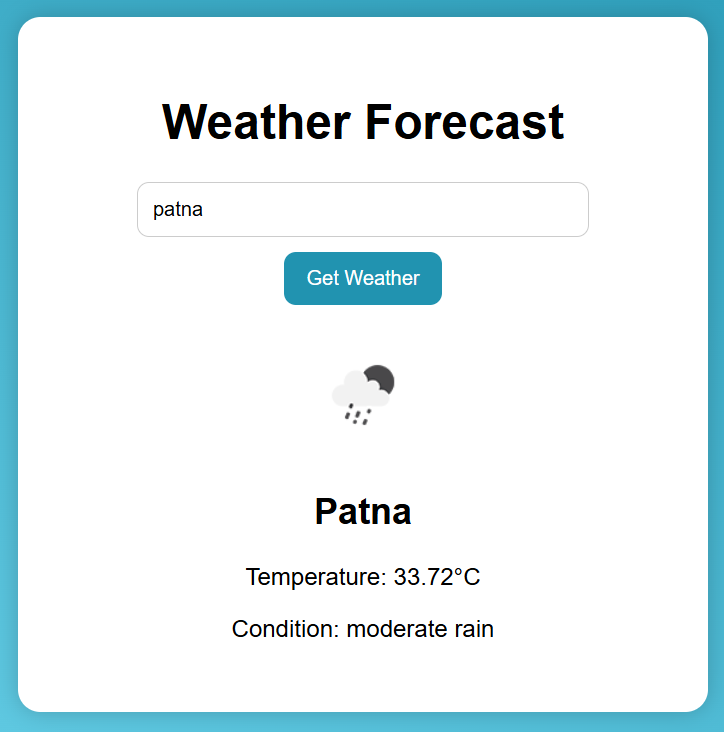

🌦️ Weather Forecast Web App
A responsive weather forecast web page built using HTML, CSS, and JavaScript that fetches real-time weather data from the OpenWeatherMap API.

  

🚀 Features
🌍 Search weather by city name

🌡️ Get temperature, weather condition, and icon

📱 Responsive UI

🧼 Clean design using HTML & CSS

🔌 Fetches real-time data using OpenWeatherMap API

🛠️ Technologies Used
HTML5

CSS3

JavaScript (Vanilla)

OpenWeatherMap API

🧪 Live Demo
(Host on GitHub Pages / Netlify and paste the link here)
[Google](https://akashraj2106.github.io/Weather-Forecast/ "Go to Google")

📝 How to Use
Clone the repository

bash
Copy
Edit
git clone https://github.com/yourusername/weather-app.git
cd weather-app
Open index.html in your browser

Get your API key
Sign up at https://openweathermap.org/api and get a free API key.

Edit script.js
Replace 'YOUR_API_KEY' with your actual API key:

javascript
Copy
Edit
const apiKey = 'YOUR_API_KEY';
